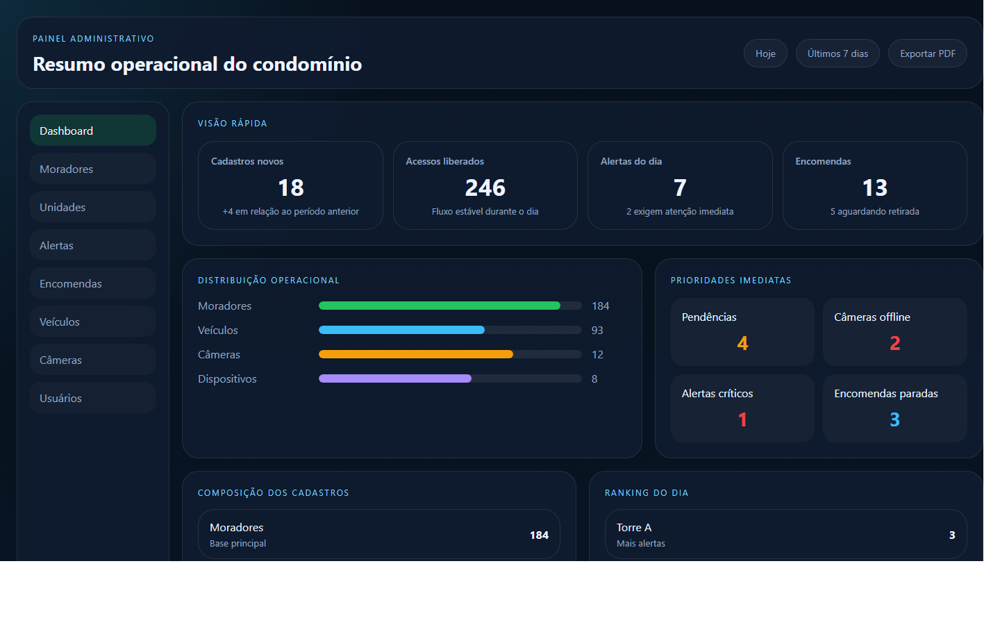
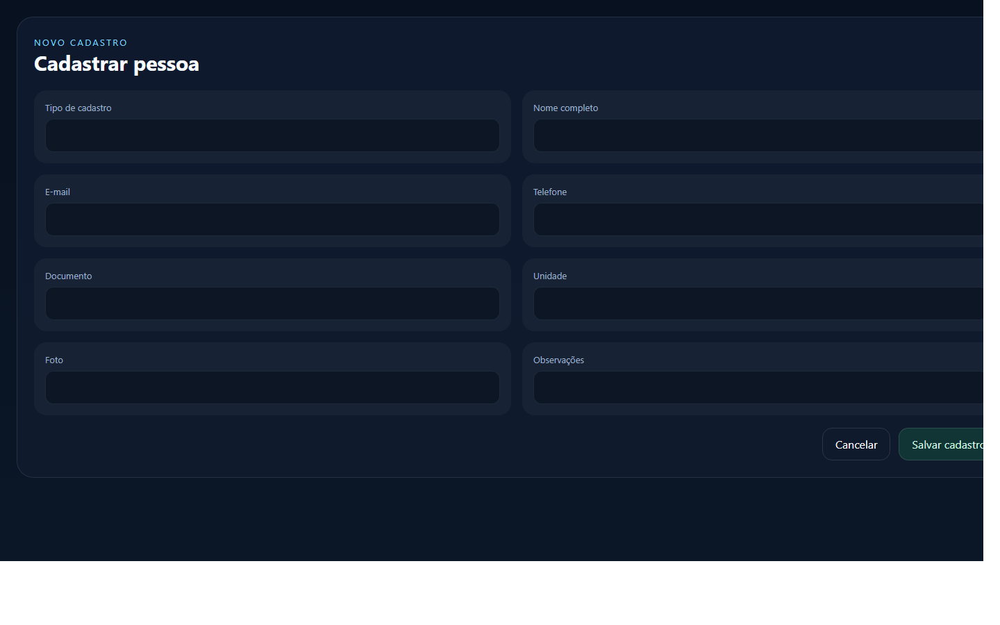
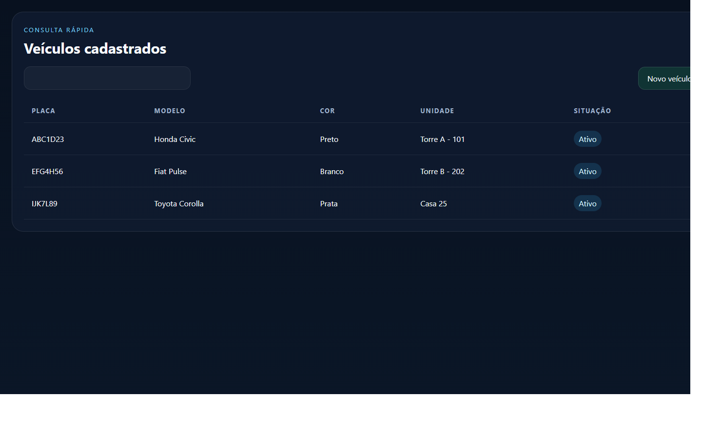

# Manual do Usuário Admin
## Portaria Web

Versão: 1.0  
Data: 23/04/2026

Este manual foi preparado para orientar o uso do perfil `Admin` do condomínio.

---

## 1. Visão geral

O perfil `Admin` é usado para a gestão diária do condomínio. Ele concentra o acompanhamento do dashboard, dos moradores, das unidades, dos veículos, das encomendas, dos alertas, das câmeras e dos usuários.

Com esse perfil, você consegue:

- acompanhar o painel do condomínio
- consultar e cadastrar pessoas
- consultar e cadastrar unidades
- gerenciar veículos
- acompanhar encomendas
- acompanhar alertas
- consultar câmeras e dispositivos
- administrar usuários do condomínio

### Imagem 1

`Adicionar captura do dashboard Admin aqui.`

Arquivo sugerido:

`docs/manual-usuario/imagens/admin-01-dashboard.png`

---

## 2. Como entrar no sistema

1. Abra o navegador.
2. Acesse o endereço do sistema.
3. Informe e-mail e senha.
4. Clique em `Entrar`.

Se o acesso estiver correto, o sistema abrirá o painel administrativo do condomínio.

### Imagem 2

`Adicionar captura da tela de login aqui.`

Arquivo sugerido:

`docs/manual-usuario/imagens/admin-02-login.png`

---

## 3. O que cada área faz

### Dashboard

Mostra um resumo visual e rápido da situação do condomínio.

### Moradores

Permite consultar, cadastrar, editar e importar pessoas.

Tipos mais comuns:

- morador
- visitante
- prestador
- locatário

### Unidades

Permite consultar e cadastrar unidades, além de apoiar a vinculação dos moradores.

### Usuários

Permite criar e administrar acessos ao sistema.

### Alertas

Mostra ocorrências e eventos que exigem atenção.

### Encomendas

Permite registrar e acompanhar encomendas até a retirada.

### Veículos

Permite cadastrar, editar e excluir veículos vinculados às unidades.

### Câmeras

Mostra a situação das câmeras cadastradas.

### Dispositivos

Mostra os equipamentos operacionais e de acesso.

---

## 4. Passo a passo das tarefas principais

## 4.1. Consultar o dashboard

1. Entre no sistema.
2. Aguarde o carregamento do painel.
3. Observe os indicadores principais.
4. Clique no card desejado para abrir a área detalhada.

## 4.2. Cadastrar uma pessoa

1. Abra a área `Moradores`.
2. Clique em `Novo cadastro`.
3. Escolha o tipo de cadastro.
4. Preencha os dados principais.
5. Se houver foto, adicione a imagem.
6. Clique em `Salvar`.

### Imagem 3

`Adicionar captura da tela de cadastro de pessoas aqui.`

Arquivo sugerido:

`docs/manual-usuario/imagens/admin-03-cadastro-pessoas.png`

## 4.3. Importar unidades por planilha

1. Abra a área `Unidades`.
2. Baixe o arquivo modelo.
3. Preencha a planilha com os dados.
4. Faça o envio do arquivo.
5. Revise a confirmação antes de concluir.

## 4.4. Importar moradores por planilha

1. Abra a área `Moradores`.
2. Baixe o arquivo modelo.
3. Preencha os dados conforme o padrão.
4. Faça o envio do arquivo.
5. Revise a prévia antes de confirmar.

## 4.5. Registrar uma encomenda

1. Abra a área `Encomendas`.
2. Clique em `Registrar encomenda`.
3. Escolha unidade ou destinatário.
4. Preencha as informações principais.
5. Adicione foto, se necessário.
6. Clique em `Salvar`.

## 4.6. Cadastrar um veículo

1. Abra a área `Veículos`.
2. Clique em `Novo veículo`.
3. Escolha a unidade correta.
4. Preencha placa e demais dados.
5. Clique em `Salvar`.

### Imagem 4

`Adicionar captura da tela de veículos aqui.`

Arquivo sugerido:

`docs/manual-usuario/imagens/admin-04-veiculos.png`

---

## 5. Boas práticas

- revise nome, unidade e vínculos antes de salvar
- mantenha fotos atualizadas quando disponíveis
- use a busca antes de cadastrar para evitar duplicidade
- acompanhe alertas e pendências diariamente

---

## 6. Dúvidas comuns

### O que devo ver no dashboard?

O dashboard é um resumo rápido. Para detalhes, clique no card da área desejada.

### Posso importar dados por planilha?

Sim, quando o módulo oferecer modelo e confirmação antes da conclusão.

### Quem acompanha a operação diária do condomínio?

O `Admin` acompanha a rotina de gestão e o perfil operacional acompanha o fluxo direto da portaria.

---

## 7. Anexos

- Imagem 1: dashboard Admin
- Imagem 2: login
- Imagem 3: cadastro de pessoas
- Imagem 4: veículos
