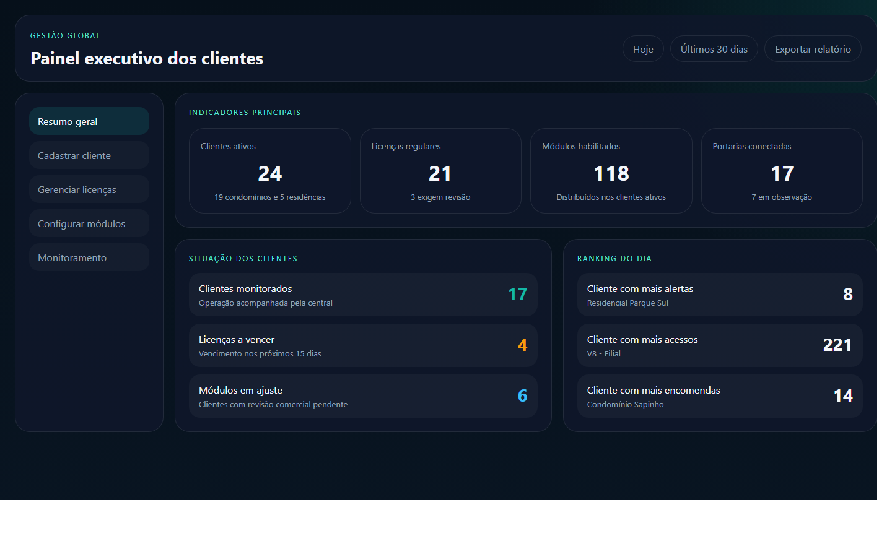
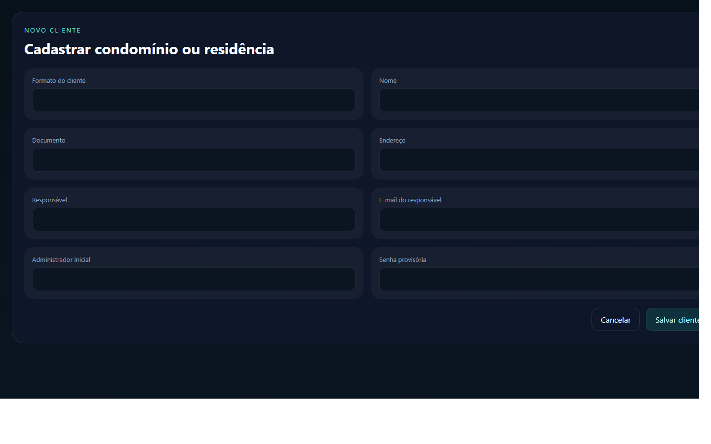

# Manual do Usuário Master
## Portaria Web

Versão: 1.0  
Data: 23/04/2026

Este manual foi preparado para orientar o uso do perfil `Master` de forma simples, prática e direta.

---

## 1. Visão geral

O perfil `Master` é responsável pela gestão global da plataforma. Nele ficam concentradas as ações de cadastro de clientes, revisão de licenças, ativação de módulos e visão executiva da operação.

Com esse perfil, você consegue:

- acompanhar o painel geral dos clientes
- cadastrar novos clientes
- revisar situação comercial
- habilitar ou desabilitar módulos
- acompanhar a situação operacional consolidada

### Imagem 1

`Adicionar captura do painel Master aqui.`

Arquivo sugerido:

`docs/manual-usuario/imagens/master-01-dashboard.png`

---

## 2. Como entrar no sistema

1. Abra o navegador.
2. Acesse o endereço do sistema.
3. Informe seu e-mail.
4. Informe sua senha.
5. Clique em `Entrar`.

Se o acesso estiver correto, o sistema abrirá o painel `Master`.

### Imagem 2

`Adicionar captura da tela de login aqui.`

Arquivo sugerido:

`docs/manual-usuario/imagens/master-02-login.png`

---

## 3. O que cada área faz

### Resumo geral

Mostra os números principais da plataforma, com indicadores de clientes, licenças, módulos e monitoramento.

### Cadastrar cliente

Permite criar um novo condomínio ou residência, preenchendo os dados principais e criando o administrador inicial.

### Gerenciar licenças

Permite revisar plano, valor, vencimento, status e período de vigência.

### Configurar módulos

Permite definir quais recursos estarão ativos para cada cliente.

### Monitoramento

Mostra uma visão central das operações acompanhadas.

---

## 4. Passo a passo das tarefas principais

## 4.1. Consultar o painel geral

1. Entre no sistema.
2. Aguarde o carregamento do painel.
3. Observe os indicadores principais.
4. Clique no card desejado para abrir a área correspondente.

## 4.2. Cadastrar um novo cliente

1. Abra a área `Cadastrar cliente`.
2. Escolha se o cadastro será de condomínio ou residência.
3. Preencha os dados principais.
4. Informe os dados do responsável.
5. Informe os dados do usuário administrador inicial.
6. Clique em `Salvar`.

### Imagem 3

`Adicionar captura da tela de cadastro de cliente aqui.`

Arquivo sugerido:

`docs/manual-usuario/imagens/master-03-cadastro-cliente.png`

## 4.3. Atualizar licença

1. Abra a área `Gerenciar licenças`.
2. Localize o cliente desejado.
3. Atualize plano, valor, vencimento e situação.
4. Confirme a alteração.

## 4.4. Atualizar módulos

1. Abra a área `Configurar módulos`.
2. Busque o cliente desejado.
3. Marque ou desmarque os módulos que devem ficar ativos.
4. Confirme a alteração.
5. Revise a mensalidade quando houver mudança de escopo.

---

## 5. Boas práticas

- revise os dados do cliente antes de salvar
- confirme sempre o vencimento e o valor da licença
- ao alterar módulos, revise impacto comercial
- use o painel geral para acompanhar o que exige ação rápida

---

## 6. Dúvidas comuns

### Quando devo usar o Master?

Quando a ação for global, comercial, contratual ou de configuração geral do cliente.

### Quem usa o Master?

Normalmente a equipe central, gestão comercial, implantação ou supervisão do produto.

### O Master altera dados operacionais do condomínio?

Pode alterar configurações que impactam a operação, mas o uso diário do condomínio fica concentrado no perfil `Admin`.

---

## 7. Anexos

- Imagem 1: painel Master
- Imagem 2: login
- Imagem 3: cadastro de cliente
