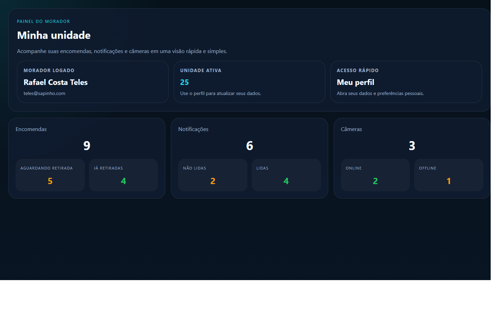
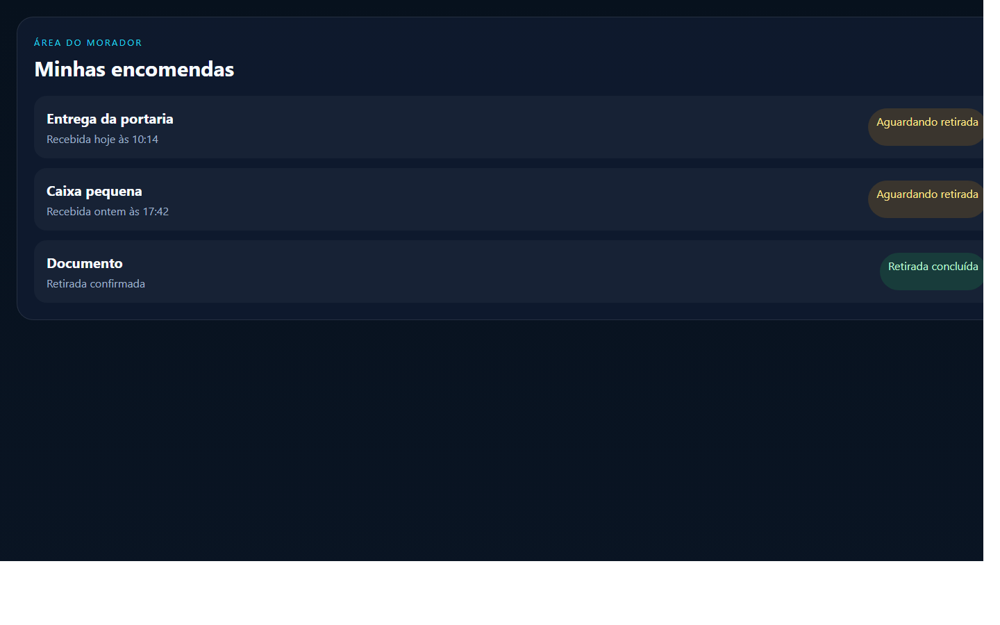

# Manual do Usuário Morador
## Portaria Web

Versão: 1.0  
Data: 23/04/2026

Este manual foi preparado para orientar o uso do perfil `Morador` no portal web.

---

## 1. Visão geral

O perfil `Morador` permite acompanhar as informações da sua unidade de forma simples e rápida.

Com esse perfil, você consegue:

- consultar suas encomendas
- acompanhar alertas recebidos
- visualizar câmeras liberadas
- consultar e atualizar o perfil
- acompanhar veículos vinculados

### Imagem 1

`Adicionar captura do painel do morador aqui.`

Arquivo sugerido:

`docs/manual-usuario/imagens/morador-01-dashboard.png`

---

## 2. Como entrar no sistema

1. Abra o navegador.
2. Acesse o endereço do sistema.
3. Informe seu e-mail.
4. Informe sua senha.
5. Clique em `Entrar`.

Se o acesso estiver correto, o sistema abrirá a sua área pessoal.

### Imagem 2

`Adicionar captura da tela de login aqui.`

Arquivo sugerido:

`docs/manual-usuario/imagens/morador-02-login.png`

---

## 3. O que cada área faz

### Dashboard

Mostra um resumo rápido da sua unidade.

### Perfil

Permite consultar e atualizar seus dados pessoais.

### Encomendas

Mostra as encomendas recebidas e o status de retirada.

### Alertas

Mostra os alertas recebidos pelo morador.

Ao abrir o alerta, ele pode ser marcado como lido.

### Câmeras

Mostra as câmeras liberadas para a sua unidade.

### Veículos

Mostra os veículos vinculados ao seu cadastro ou unidade, quando esse recurso estiver disponível.

---

## 4. Passo a passo das tarefas principais

## 4.1. Consultar encomendas

1. Entre no sistema.
2. Abra a área `Encomendas`.
3. Veja as encomendas disponíveis.
4. Abra o item desejado para ver os detalhes.

## 4.2. Ver o código de retirada

1. Abra a encomenda desejada.
2. Veja o QR code ou o código de retirada.
3. Apresente a informação no momento da retirada.

### Imagem 3

`Adicionar captura da tela de encomendas aqui.`

Arquivo sugerido:

`docs/manual-usuario/imagens/morador-03-encomendas.png`

## 4.3. Consultar alertas

1. Abra a área `Alertas`.
2. Veja os registros recebidos.
3. Abra o alerta desejado.
4. Leia os detalhes e veja a imagem, quando disponível.

## 4.4. Consultar câmeras

1. Abra a área `Câmeras`.
2. Veja as câmeras disponíveis para sua unidade.
3. Consulte a visualização liberada pelo condomínio.

## 4.5. Atualizar o perfil

1. Abra a área `Perfil`.
2. Revise seus dados.
3. Faça as alterações permitidas.
4. Clique em `Salvar`.

---

## 5. Boas práticas

- mantenha seus dados atualizados
- acompanhe regularmente as encomendas
- verifique os alertas recebidos
- confira se a unidade ativa está correta antes de consultar informações

---

## 6. Dúvidas comuns

### O morador resolve alertas?

Não. O morador recebe a informação e acompanha o alerta. A tratativa operacional fica com a portaria.

### O QR code substitui o código de retirada?

Sim. Na retirada, pode ser apresentado o QR code ou o código informado na tela.

### O morador vê tudo do condomínio?

Não. O morador vê somente o que estiver liberado para sua unidade e para o seu perfil.

---

## 7. Anexos

- Imagem 1: dashboard do morador
- Imagem 2: login
- Imagem 3: encomendas
