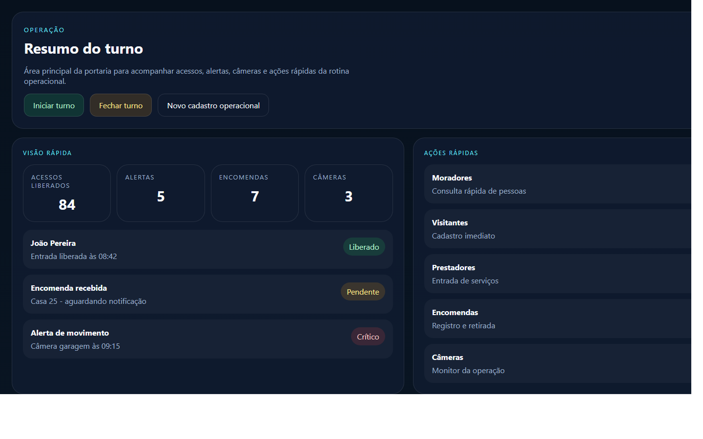
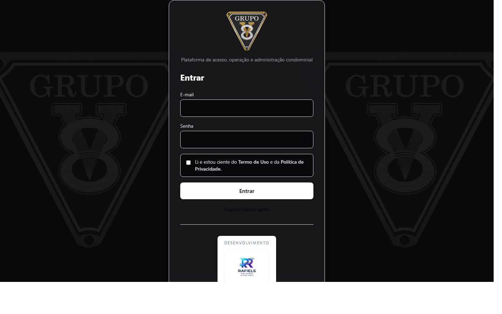
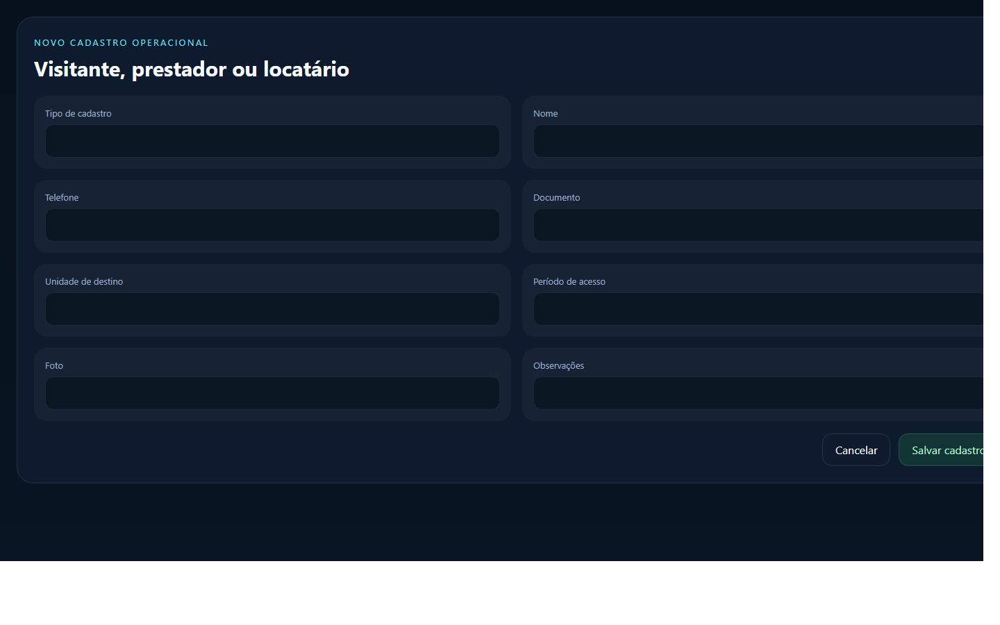

# Manual do Usuário Operador
## Portaria Web

Versão: 1.0  
Data: 23/04/2026

Este manual foi preparado para orientar o uso do perfil `Operador`, com foco na rotina da portaria e no atendimento rápido do dia a dia.

---

## 1. Visão geral

O perfil `Operador` é usado na portaria para acompanhar a rotina operacional em tempo real.

Com esse perfil, você consegue:

- iniciar e fechar turno
- consultar moradores, visitantes, prestadores e locatários
- fazer cadastro rápido
- registrar encomendas
- acompanhar alertas
- consultar câmeras
- consultar histórico de acessos
- usar busca por foto

### Imagem 1

`Adicionar captura da tela operacional aqui.`

Arquivo sugerido:

`docs/manual-usuario/imagens/operador-01-operacao.png`

---

## 2. Como entrar no sistema

1. Abra o navegador.
2. Acesse o endereço do sistema.
3. Informe seu e-mail.
4. Informe sua senha.
5. Clique em `Entrar`.

Se o acesso estiver correto, o sistema abrirá a área operacional.

### Imagem 2

`Adicionar captura da tela de login aqui.`

Arquivo sugerido:

`docs/manual-usuario/imagens/operador-02-login.png`

---

## 3. O que cada área faz

### Resumo do turno

Mostra a situação atual do turno, com acesso rápido às ações mais usadas.

### Cadastro rápido

Permite criar cadastro operacional de:

- visitante
- prestador
- locatário

### Alertas

Mostra os eventos recentes da operação para análise rápida.

### Câmeras

Permite consultar as câmeras liberadas e abrir o monitor.

### Encomendas

Permite registrar, consultar e acompanhar as encomendas da portaria.

### Histórico de acessos

Permite consultar os registros recentes de entrada e saída.

### Busca por foto

Permite pesquisar uma pessoa por imagem ou usar a câmera selecionada, quando o recurso estiver disponível.

---

## 4. Passo a passo das tarefas principais

## 4.1. Iniciar o turno

1. Entre no sistema.
2. Aguarde o carregamento da área operacional.
3. Clique em `Iniciar turno`, quando necessário.
4. Confirme para começar a rotina operacional.

## 4.2. Fechar o turno

1. Clique em `Fechar turno`.
2. Preencha as observações da passagem de turno.
3. Escolha se o turno será apenas pausado ou finalizado.
4. Confirme a ação.

## 4.3. Fazer cadastro rápido

1. Abra `Novo cadastro operacional`.
2. Escolha o tipo de cadastro.
3. Informe nome, unidade e dados principais.
4. Adicione foto, quando necessário.
5. Clique em `Salvar`.

### Imagem 3

`Adicionar captura do cadastro rápido aqui.`

Arquivo sugerido:

`docs/manual-usuario/imagens/operador-03-cadastro-rapido.png`

## 4.4. Registrar uma encomenda

1. Abra a área `Encomendas`.
2. Clique em `Registrar encomenda`.
3. Escolha unidade ou destinatário.
4. Preencha os dados principais.
5. Salve o registro.

## 4.5. Consultar alertas

1. Abra a área `Alertas`.
2. Veja os eventos mais recentes.
3. Abra o alerta desejado para analisar os detalhes.
4. Faça o encaminhamento conforme a rotina do condomínio.

## 4.6. Consultar câmeras

1. Abra a área `Câmeras`.
2. Escolha a câmera desejada.
3. Veja o monitor da operação.

## 4.7. Usar busca por foto

1. Abra o bloco `Busca por foto`.
2. Envie uma imagem ou selecione a câmera disponível.
3. Aguarde o resultado da pesquisa.
4. Consulte a pessoa identificada ou os registros relacionados.

---

## 5. Boas práticas

- mantenha o turno corretamente iniciado
- confira a unidade antes de salvar um cadastro
- registre observações claras na troca de turno
- acompanhe alertas críticos primeiro
- use a busca antes de cadastrar para evitar duplicidade

---

## 6. Dúvidas comuns

### O operador pode cadastrar visitante, prestador e locatário?

Sim. O cadastro rápido foi preparado para esse uso operacional.

### O turno precisa ser encerrado ao sair da página?

O ideal é sempre registrar corretamente se o turno está sendo finalizado ou apenas pausado.

### O operador resolve o alerta no sistema?

O operador acompanha, registra a ação necessária e segue a rotina definida pelo condomínio.

---

## 7. Anexos

- Imagem 1: tela operacional
- Imagem 2: login
- Imagem 3: cadastro rápido
